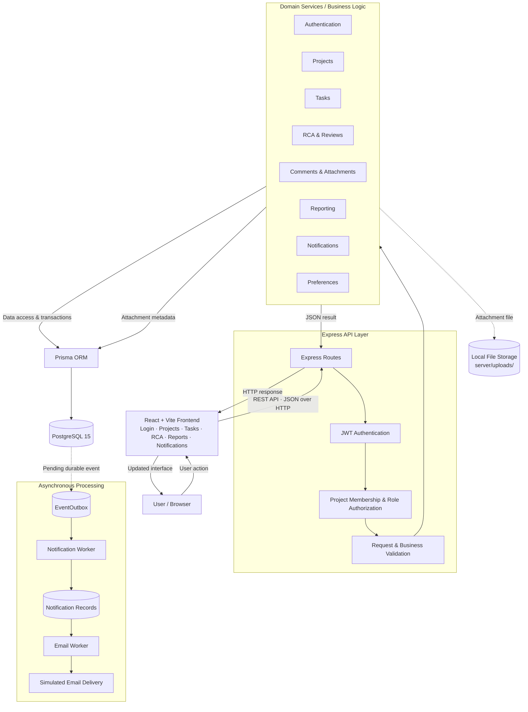
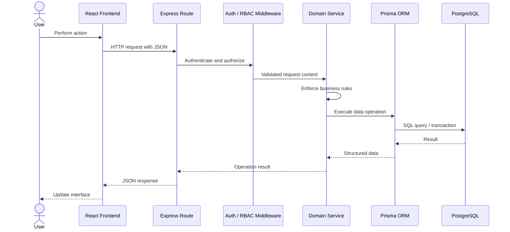
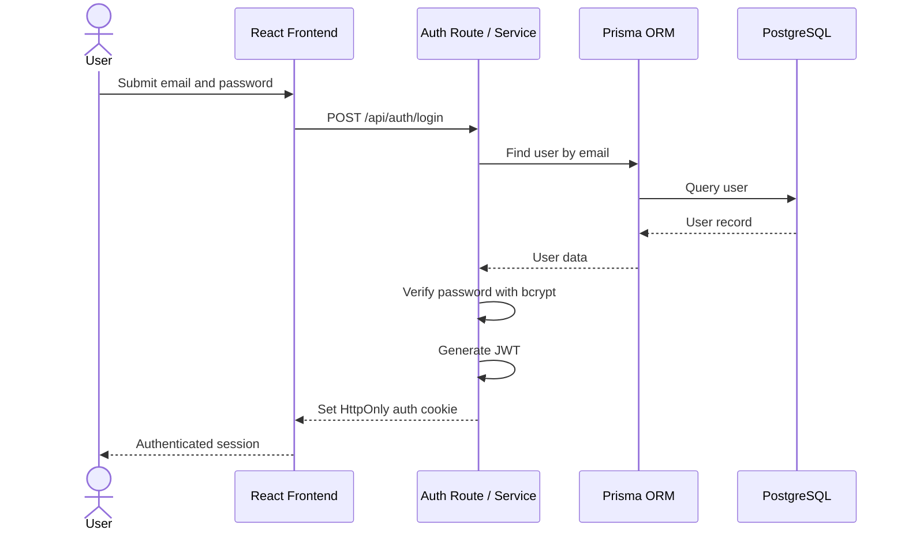
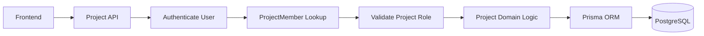
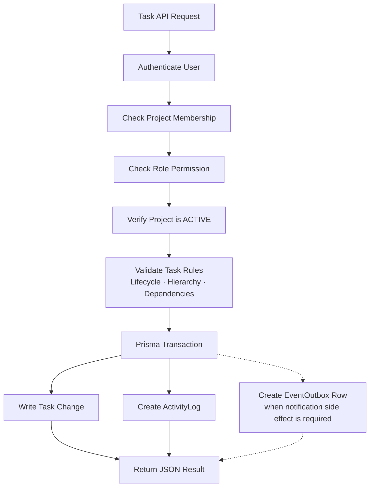
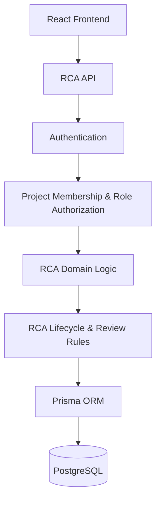
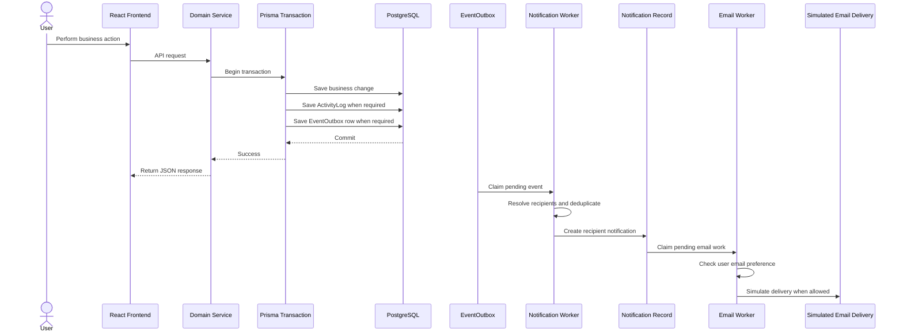
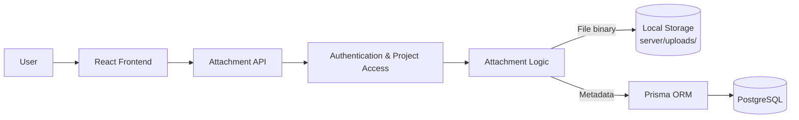

# TeamFlow API and Service Interaction Overview

## Overview

TeamFlow uses a REST-based API architecture within a modular monolith. The React and Vite frontend communicates with the Node.js and Express backend through synchronous HTTP requests and JSON responses.

The backend is divided into domain-focused modules, while persistent relational data is accessed through Prisma ORM and stored in PostgreSQL 15. Suitable secondary work, such as notification and simulated email delivery, is processed asynchronously through database-backed background workers.

---

## Interaction Overview

---

## Synchronous Request Processing

A typical core API request follows this path:

**User Action → React Frontend → Express Route → Middleware → Domain Service / Business Logic → Prisma → PostgreSQL → JSON Response**

Security and business rules are enforced by the backend rather than relying on frontend controls.

---

## Authentication Interaction

Authentication uses JWT-based access control with an HttpOnly cookie.

For protected requests, the authentication middleware verifies the JWT and attaches the authenticated user context before authorization and business-rule checks continue.

---

## Project Interaction

Project operations combine authentication with project-scoped authorization.

`ProjectMember` determines whether a user is a `MANAGER`, `MEMBER`, or `REVIEWER` within a specific project.

A user can therefore hold different roles in different projects.

---

## Task Interaction

Task operations contain important authorization and workflow checks.

This interaction ensures that:

- unauthorized users cannot perform restricted actions;
- archived projects reject operational task and dependency mutations;
- invalid task lifecycle transitions are rejected;
- parent-child relationships remain project-scoped and acyclic;
- task dependencies remain project-scoped and acyclic;
- required related writes succeed or fail atomically.

---

## RCA and Review Interaction

TeamFlow uses an RCA workflow rather than a separate Incident entity.

RCA investigations, structured sections, and reviews remain inside the same modular monolith. Internal modules interact through in-process application logic rather than network calls between separate microservices.

---

## Asynchronous Notification Interaction

Notifications are processed separately from the main HTTP response path.

The main API request does not wait for notification or email delivery. This improves responsiveness and isolates secondary delivery failures from the core business operation.

`ActivityLog` and `EventOutbox` have different responsibilities:

- `ActivityLog` preserves audit and history records.
- `EventOutbox` provides durable asynchronous event delivery.

---

## Attachment Interaction

Task attachments use local file storage in the current MVP.

The file binary is stored on the application server's local filesystem, while metadata such as the original filename, storage key, MIME type, size, uploader, and related task is stored in PostgreSQL.

---

## Internal Service Interaction Rule

Because TeamFlow is a modular monolith, internal domain modules do not communicate through network calls.

The preferred interaction is:

**Express Route → Middleware → Domain Service / Business Logic → Required Internal Logic / Prisma**

TeamFlow does not use internal communication such as:

**Task Microservice → HTTP → Notification Microservice → HTTP → Project Microservice**

Keeping domain interactions in-process avoids unnecessary network overhead, distributed transactions, service discovery, and additional deployment complexity.

---

## Interaction Summary

TeamFlow uses synchronous REST APIs for communication between the React frontend and Express backend. Requests pass through authentication, project-scoped authorization, validation, and domain business rules before Prisma accesses PostgreSQL.

Core operations return immediate JSON responses. Related writes are performed atomically where consistency requires it, `ActivityLog` preserves important history, and `EventOutbox` separates durable notification events from the main request path.

Asynchronous background workers process notification and simulated email delivery without requiring internal microservices or a separate message broker. This interaction model supports clear domain boundaries while retaining the operational simplicity of a modular monolith.
