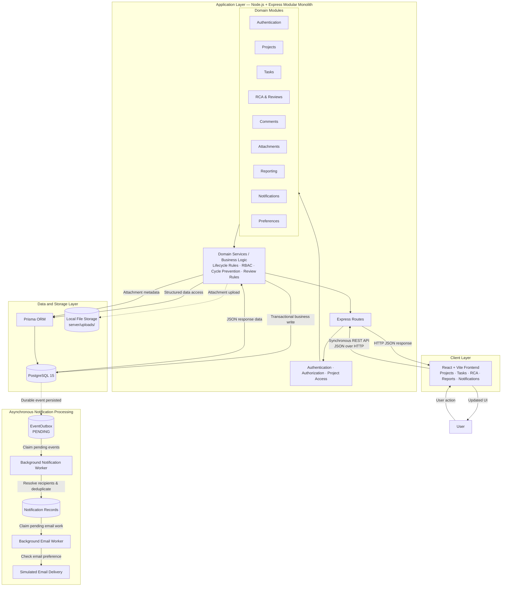

# TeamFlow System Architecture

## Architecture Summary

TeamFlow uses a modular monolith architecture with a React and Vite frontend, a Node.js and Express backend, Prisma ORM, and PostgreSQL 15.

Core user operations follow a synchronous request path:

User → React Frontend → Express Route → Middleware → Domain Service / Business Logic → Prisma → PostgreSQL → JSON Response

The backend is divided into domain-focused modules while remaining a single deployable application. Authentication, authorization, task lifecycle rules, project-scoped dependency validation, hierarchy validation, and RCA review rules are enforced by the backend.

Attachment files are stored on the application server's local filesystem under server/uploads/, while attachment metadata is stored in PostgreSQL.

Notification delivery is processed asynchronously. Relevant business operations persist durable events in EventOutbox, and background workers later resolve recipients, create notification records, apply email preferences, and perform simulated email delivery.

ActivityLog is the audit and history mechanism. EventOutbox is a durable event-delivery mechanism and is not used as an audit log.
