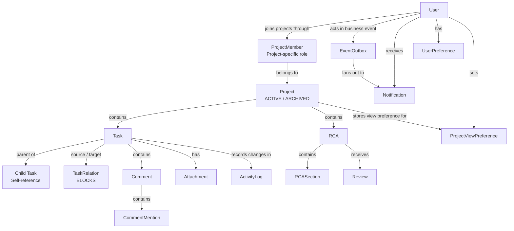
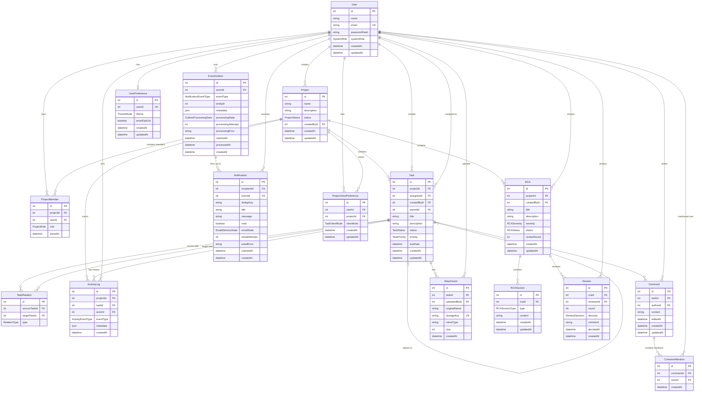
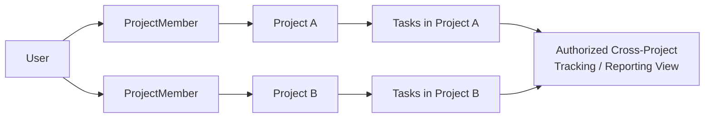

# TeamFlow ERD and Domain Model

## 1. Domain Model Overview

TeamFlow is centred on users collaborating within projects. A `Project` acts as the main boundary for authorization, task execution, RCA investigations, activity history, and project-specific preferences.

Users join projects through `ProjectMember`, which stores their role within each project. Because the same user can have memberships in multiple projects, TeamFlow can track a user's work across more than one project without weakening project-level authorization boundaries.

Projects contain tasks and RCA investigations. Tasks support assignments, controlled lifecycle states, parent-child hierarchies, project-scoped dependency relationships, comments, mentions, attachments, and activity history.

RCA investigations contain structured sections and can pass through multiple review rounds. Relevant business operations can create durable events in `EventOutbox`, which are processed asynchronously into recipient-specific notifications.

---

## 2. Domain Model



---

## 3. Entity Relationship Diagram

The following ERD represents the core TeamFlow data model implemented through Prisma and PostgreSQL.



`HealthCheck` is an infrastructure-support model and is intentionally excluded from the core domain ERD.

---

## 4. Entities and Important Modelling Decisions

### 4.1 User, Project, and Project Membership

Users and projects have a many-to-many relationship resolved through `ProjectMember`.

**User 1 → N ProjectMember N ← 1 Project**

`ProjectMember` is a first-class entity because it stores the user's role within a specific project.

Supported project roles are:

- `MANAGER`
- `MEMBER`
- `REVIEWER`

The same user can therefore be:

- a MANAGER in Project A;
- a MEMBER in Project B;
- a REVIEWER in Project C.

This design supports users who contribute to and track work across multiple projects while preserving project-specific permissions.

---

### 4.2 Project and Task

A project contains many tasks.

**Project 1 → N Task**

Every task belongs to exactly one project through `projectId`.

This ownership rule gives each task a clear:

- authorization boundary;
- lifecycle context;
- reporting context;
- membership scope.

A task is not duplicated merely because it needs to appear in multi-project tracking or reporting. Cross-project views can aggregate tasks from the projects that the user is authorized to access.

---

### 4.3 Task Hierarchy

Subtasks are represented through a self-referencing relationship on `Task`.

**Task 1 → N Task**

A child task stores `parentId`, which references another task.

This design was chosen instead of creating a separate `Subtask` entity because a child task has the same properties and lifecycle behaviour as any other task.

The following constraints apply:

- parent and child tasks must belong to the same project;
- a task cannot be its own parent;
- hierarchy cycles are rejected.

---

### 4.4 Task Dependencies

Task dependencies are represented through the separate `TaskRelation` entity.

A relation connects:

**sourceTask → BLOCKS → targetTask**

The separate relation entity was chosen instead of storing dependency IDs directly on `Task` because a task may participate in multiple dependency relationships.

The model supports:

- one task blocking multiple tasks;
- one task being blocked by multiple tasks;
- dependency graph traversal;
- explicit relation types;
- normalized dependency data.

The following constraints apply:

- a task cannot depend on itself;
- duplicate dependency relationships are rejected;
- dependency cycles are rejected;
- both tasks must belong to the same project.

Project-scoped dependencies preserve clear ownership and authorization boundaries.

---

## 5. Tasks Across More Than One Project

The assignment requires the model to accommodate tasks that need to be tracked across more than one project.

TeamFlow addresses this without allowing one task row to belong to multiple projects.

Each task has one authoritative owner:

**Task N → 1 Project**

Multi-project tracking is supported through the surrounding relational model:



For example, a user who belongs to Project A and Project B can view or report on authorized tasks from both projects.

This design deliberately separates two concepts:

- **Task ownership:** each task belongs to exactly one project.
- **Multi-project tracking:** authorized tasks from multiple projects can be aggregated for reporting and visibility.

This avoids duplicating tasks or weakening project-specific authorization.

Cross-project task dependencies are not allowed in the current implementation. If a future requirement needs one project to depend directly on work in another project, the model could be extended with an explicit cross-project coordination entity rather than weakening the existing project-scoped `TaskRelation` invariant.

---

## 6. Task Collaboration

Tasks support collaboration through comments, mentions, and attachments.

A `Comment` belongs to a task and is written by a user.

A `CommentMention` connects a comment to a mentioned user.

An `Attachment` belongs to a task and records:

- uploader;
- original filename;
- storage key;
- MIME type;
- file size.

The actual attachment file is stored on the application server's local filesystem, while its metadata is stored in PostgreSQL.

---

## 7. Activity History

`ActivityLog` is TeamFlow's audit and history mechanism.

Important task operations can create activity records containing:

- project;
- task;
- actor;
- event type;
- metadata;
- timestamp.

Where required by the business operation, the domain change and its corresponding activity record are persisted atomically.

`ActivityLog` is distinct from `EventOutbox`:

- `ActivityLog` preserves audit and history records.
- `EventOutbox` supports durable asynchronous event delivery.

---

## 8. RCA and Reviews

A project can contain multiple RCA investigations.

**Project 1 → N RCA**

An RCA contains structured `RCASection` records and can receive multiple `Review` records across review rounds.

The RCA lifecycle supports structured investigation and review without requiring a separate Incident entity.

Review records capture:

- reviewer;
- review round;
- decision;
- optional comment;
- decision timestamp.

---

## 9. Event Outbox and Notifications

Relevant business operations can persist durable events in `EventOutbox`.

The asynchronous flow is:

**Business Operation → EventOutbox → Background Worker → Notification**

An outbox event can fan out into multiple notifications for different recipients.

`Notification` records track:

- recipient;
- source event;
- deduplication key;
- title and message;
- read state;
- email delivery state;
- retry information.

`EventOutbox` is a durable event-delivery mechanism and is not an audit log.

---

## 10. User and Project View Preferences

`UserPreference` stores user-level preferences such as:

- theme;
- email opt-out.

`ProjectViewPreference` stores the user's preferred task view for a specific project.

This separates global user preferences from project-specific interface preferences.

---

## 11. Constraints and Business Invariants

The domain model enforces the following major constraints:

1. Every task belongs to exactly one project.
2. Parent and child tasks must belong to the same project.
3. Task dependency relationships must remain within the same project.
4. Self-dependencies are rejected.
5. Duplicate dependency relationships are rejected.
6. Dependency cycles are rejected.
7. Task hierarchy cycles are rejected.
8. Project membership is unique for a user-project combination.
9. Authorization depends on project membership and project-specific roles.
10. Tasks are not hard-deleted.
11. Archived projects reject operational task and dependency mutations.
12. Important business changes are recorded through `ActivityLog`.
13. Related writes are performed atomically where consistency requires it.
14. Notification delivery is separated from core request processing through `EventOutbox`.

---

## 12. Lifecycle Rules

### Project Lifecycle

```text
ACTIVE → ARCHIVED
```

An active project supports normal operations. After archival, operational task and dependency mutations are rejected.

### Task Lifecycle

Tasks use controlled states:

```text
TODO
IN_PROGRESS
BLOCKED
DONE
```

Valid transitions are enforced by backend business rules rather than allowing arbitrary status changes.

### Task Hierarchy Lifecycle

When a parent-child relationship is created or changed:

1. both tasks are verified;
2. project ownership is checked;
3. self-parenting is rejected;
4. hierarchy cycles are checked;
5. the relationship is persisted only if all rules pass.

### Dependency Lifecycle

When a dependency is created:

1. the source and target tasks are verified;
2. both tasks must belong to the same project;
3. self-dependency is rejected;
4. duplicate relations are rejected;
5. the dependency graph is checked for cycles;
6. the relation is persisted only if all checks pass.

### RCA Lifecycle

RCA investigations progress through controlled investigation and review states.

Structured sections store investigation content, while `Review` records preserve decisions across review rounds.

### Notification Lifecycle

Relevant business operations can create `EventOutbox` records as part of the required transaction.

Background workers later:

1. claim pending events;
2. resolve recipients;
3. deduplicate notifications;
4. create recipient-specific notification records;
5. process eligible email delivery separately.

---

## 13. Domain Model Summary

TeamFlow is centred on `Project` as the main collaboration and authorization boundary. Users join projects through `ProjectMember`, allowing the same user to participate in and track work across multiple projects with different roles.

Each task belongs to exactly one project, while `TaskRelation` models project-scoped task dependencies. This supports complex dependency graphs without duplicating task data or weakening project ownership boundaries.

Multi-project tracking is handled by aggregating authorized tasks from the projects in which a user participates. Cross-project dependencies are intentionally not part of the current implementation.

Projects also contain RCA investigations with structured sections and multi-round reviews. Tasks support comments, mentions, attachments, and activity history. `ActivityLog` preserves audit history, while `EventOutbox` supports durable asynchronous notification delivery.

The relational model is well suited to PostgreSQL because TeamFlow depends on strong entity relationships, foreign keys, uniqueness constraints, transactions, and explicit workflow boundaries.
